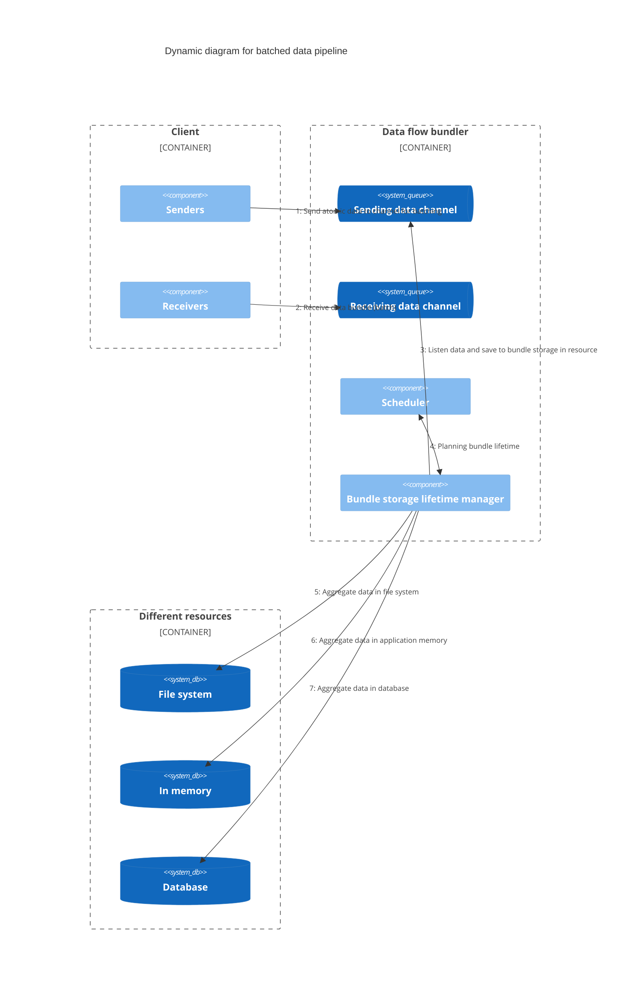

# Data flow bundler

A simple implementation of a message-based channel for processing data in bundle (batch).

```mermaid
C4Dynamic
    title Dynamic diagram for batched data pipeline
    
    Container_Boundary(client, "Client") {
        Component(senders, "Senders")
        Component(receivers, "Receivers")
    }
    
    Container_Boundary(Library, "Data flow bundler") {
        SystemQueue(sending_data_channel, "Sending data channel")
        SystemQueue(receiving_data_channel, "Receiving data channel")
        Component(scheduler, "Scheduler")
        Component(lt_manager, "Bundle storage lifetime manager")
    }
    
    Container_Boundary(Resources, "Different resources") {
        SystemDb(file_system, "File system")
        SystemDb(in_memory, "In memory")
        SystemDb(database, "Database")
    }
    
    Rel(senders, sending_data_channel, "Send atomic data to channel for batching")
    Rel(receivers, receiving_data_channel, "Receive data bundle (batch)")
    Rel(lt_manager, sending_data_channel, "Listen data and save to bundle storage in resource")
    BiRel(lt_manager, scheduler, "Planning bundle lifetime")
    Rel(lt_manager, file_system, "Aggregate data in file system")
    Rel(lt_manager, in_memory, "Aggregate data in application memory")
    Rel(lt_manager, database, "Aggregate data in database")
```

